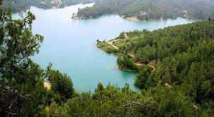
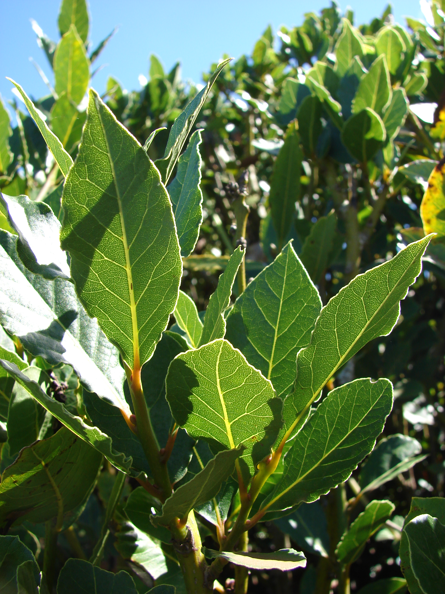
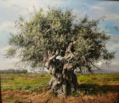
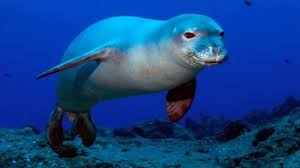
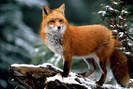
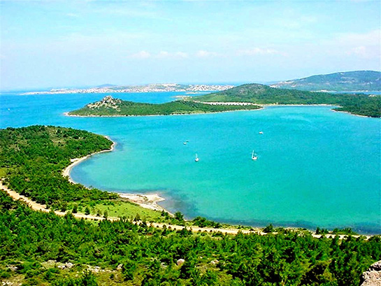

<!DOCTYPE html>
<html lang="tr">
<head>
    <meta charset="UTF-8">
    <title>Akdeniz İklimi</title>
    
</head>
<body>

    <header>
        <h1>Akdeniz İklimi</h1>
    </header>

    <nav>
        
Ana Sayfa

        
Görseller

        
Bitki Türleri

        
Hayvan Türleri

        
İklim ve Etkiler

    </nav>

    

        <h2>Genel Bakış</h2>
        
Akdeniz iklimi, sıcak ve kurak yazlarla ılık ve yağışlı kışların görüldüğü, ılıman bir iklim tipidir. Türkiye'de en çok Akdeniz kıyılarında, Ege'nin güneyinde ve Marmara'nın batısında görülür. Tarım, turizm ve biyolojik çeşitlilik açısından oldukça zengindir.

        

            
        

    

    

        <h2>Tüm Görseller</h2>
        

            
            
            
            
            
            
        

    

    

        <h2>Akdeniz Bitki Türleri</h2>
        
Akdeniz iklimi, kurak yazlara uyum sağlamış bitki örtüsüyle tanınır. En yaygın bitki formasyonu **maki**dir. Makiler; bodur, her dem yeşil çalılardan oluşur. Defne, zeytin, keçiboynuzu, kocayemiş, zakkum ve lavanta bu bölgenin simgesel bitkilerindendir.

        
Akdeniz iklimi ayrıca zeytinlikler ve turunçgil bahçeleri ile dikkat çeker. Ormanlık alanlarda kızılçam ve karaçam türleri görülür. Yaz kuraklığına dayanıklı aromatik bitkiler de oldukça yaygındır.

        

            
            
        

    

    

        <h2>Akdeniz Hayvan Türleri</h2>
        
Akdeniz iklimi, çeşitli canlı türlerine ev sahipliği yapar. Özellikle **endemik türler** açısından zengindir. Türkiye kıyılarında nadir görülen **Akdeniz fokları (Monachus monachus)** bu iklimin simgesel türlerinden biridir. 

        
Ayrıca kızıl geyik, yaban keçisi, kirpi, sincap, porsuk gibi kara hayvanları da yaygındır. Kuş türleri açısından da zengindir; ötücü kuşlar, atmaca ve yırtıcı kuşlar burada yaşam sürer. Bu biyoçeşitlilik Akdeniz havzasını dünya çapında özel kılar.

        

            
            
        

    

    

        <h2>İklim ve Etkiler</h2>
        
Akdeniz iklimi, tarım ve turizm sektörünü destekleyen önemli bir faktördür. Zeytin, portakal, üzüm ve lavanta gibi ürünler ekonomik değeri yüksek tarım ürünleridir. Ayrıca yaz aylarında sıcak ve kuru hava sayesinde Akdeniz kıyıları milyonlarca turisti ağırlar.

        
Ancak uzun süren kuraklıklar su kaynaklarını zorlayabilir ve orman yangını riskini artırır. Bu nedenle sürdürülebilir kaynak yönetimi büyük önem taşır.

        

            
        

    

    

</body>
</html>
